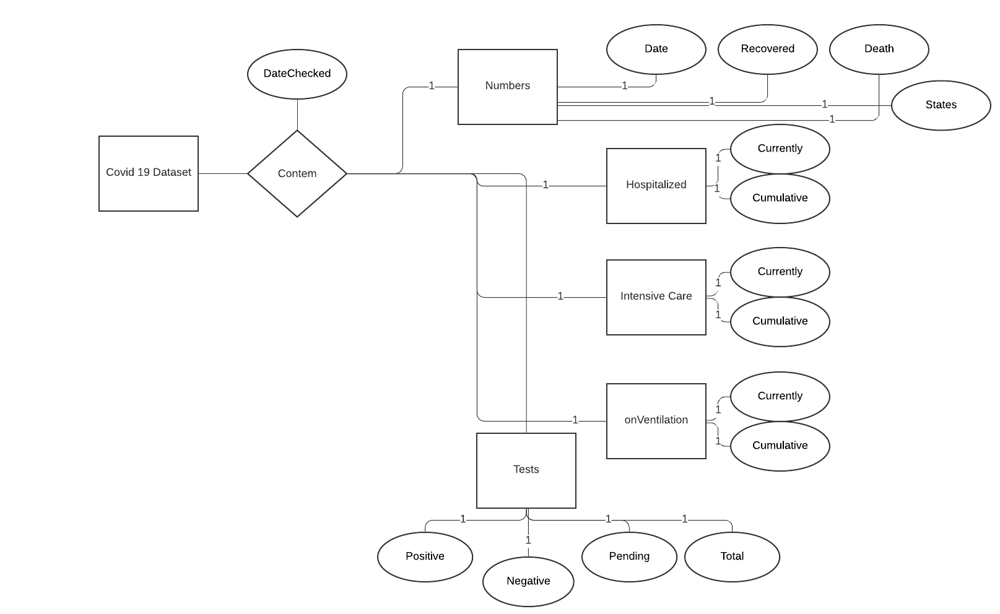

# Modelo para Apresentação do Lab01 - API Acesso

# Aluno
* Enrico Piovesana Fernandes
# RA
* 233895

## Tarefa 1 sobre APIs de acesso
* Notebook com a resolução da tarefa 1 sobre APIs de acesso
> 

## Tarefa 2 sobre Engenharia Reversa
* Diagrama para o segundo conjunto de dados coletados através de API - Covid US Data Set
> 
