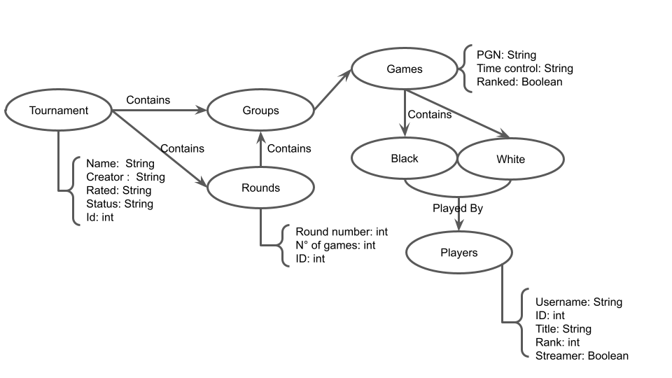

# Modelo para Apresentação do Lab07 - Modelo Lógico para Banco de Dados de Grafos

# Aluno
* `233895`: `<Enrico Piovesana Fernandes>`

## Modelo Lógico do Banco de Dados de Grafos
> 

## Perguntas de Pesquisa/análise

> Liste aqui as três perguntas de pesquisa/análise
> * Quais os jogadores que participam de um torneio específico e em quais rounds eles jogaram?
> * De quantos torneios um jogadores específico já participou?
> * Em um torneio típico, qual a porcentagem de vitórias de peças pretas ou brancas?
