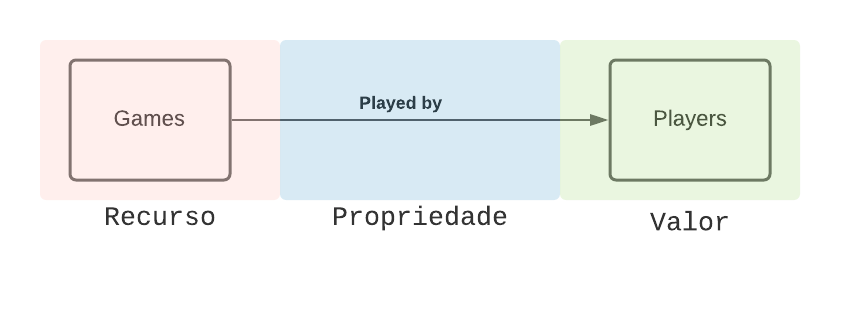

# Modelo para Apresentação do Lab09 - Bancos de Dados de Grafos + Grafo de Conhecimento

# Aluno
* `233895`: `<Enrico Piovesana Fernandes>`

## Modelo Lógico do Banco de Dados de Grafos
> Nosso banco de dados pode ser apresentado como um grafo de conhecimento, como no modeço seguinte:
> 

## Queries/Perguntas possíveis

> Dúvidas como as seguintes poderiam ser respondidas com o grafo de conhecimento do nosso banco de dados
> * Qual o oponente mais frequente de um jogador específico?
> * Dentre os jogos de um jogador, jogando como qual cor ele tem maior taxa de vitória?
> * Qual abertura leva a maior taxa de vitória para um jogador específico?
